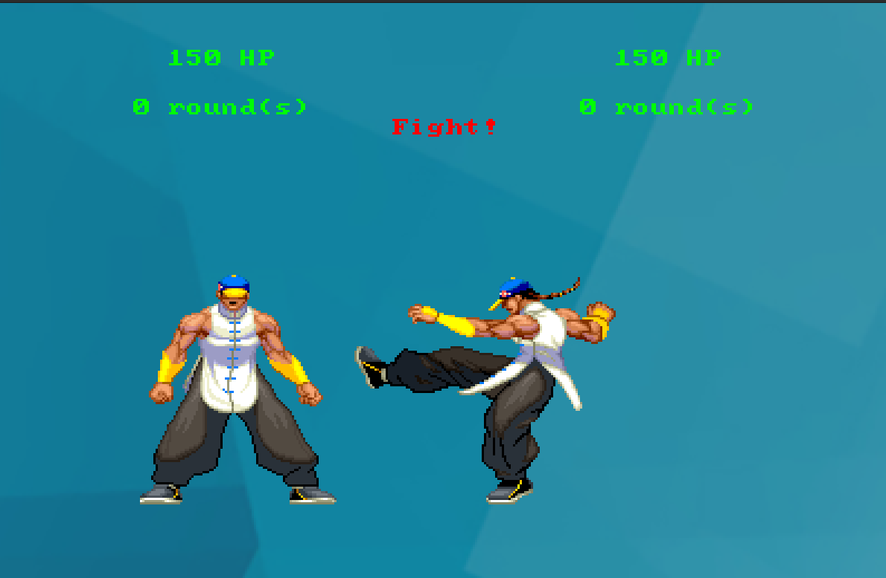

# TNF is Not Footsies!



## TNF is a simple fighting game heavily inspired by FOOTSIES, a game by HiFight.

### TNF has simple mechanics, like FOOTSIES, such as a long ranged slow normal attack, and other attack, that is faster but short ranged, another special punishable attack, and movements such as dashing and backdashing. 

### But what makes TNF Not [like] Footsies is the fact that now the players have to worry more about the opponent's offense: there are now "low" attacks, "high" attacks and "mid" attacks, so TNF feels more like a modern fighting game. Low attacks can only be blocked if the player blocks while crouching, and high attacks need to be blocked when standing. Mid attacks can be blocked no matter the player's stance.

### Before we take a look at the game's implementation, it would help a lot to understand how fighting games actually work. For that, I'll get some help from Core-A Gaming's video ["What Makes a Move Overpowered?"](https://www.youtube.com/watch?v=uQnfm911Xoc). It's a quite short and interesting video that explains easily the fundamentals of fighting games.

### Now that we're familiar with "Frame Advantage" (a.k.a "Frame Data"), we can check out what moves TNF offers so we can play it in a more interesting way that simply randomly mashing buttons. Although [Button Mashing Works (Sometimes)](https://www.youtube.com/watch?v=b2wX4EiD5tg) (Another video from Core-A Gaming, now explaining how fighting games input system work), we can now take a look on what moves each player has got:

#

### Standing still (idle) or Crouching
#### (nothing) or ↓
#### You're just standing there waiting for your opponent.
#

### Walking backwards and forward
#### → and ←
#### In this game, you "Block" by holding "backwards". For instance, if your character is facing the right side of the screen, press LEFT to block. (You can block while crouching too.)
#

### Dashing and Backdashing
#### →+→{Forward} and ←+←{Backwards}
#

### Punch
#### 👊
#### This is the fastest attack in the game. It is used to interrupt the opponent's pressure and used to "punish" attacks with lots of recovery frames (such as Dash Punch and Overhead Kick). It "cancels"(comboes) into Dash Punch.
#

### Kick
#### 👟
#### This is a "low" hitting attack, which means that it can only be blocked if the opponent is crouch blocking. It also cancels into Dash Punch, but has more Startup Frames and Recovery Frames than the Punch.
#

### Overhead Kick
#### →{Forward} + 👟
#### This is a "high" hitting attack, and can only be blocked if the opponent is blocking standing. It has got more Recovery Frames than the moves above, so beware of Punches if the opponent blocks your move.
#

### Dash Punch
#### ↓, →{Forward} + 👊
#### This is the most powerful move in the game, if you hit your opponent successfully. It deals quite a lot of damage. However, if your opponent blocks this move, you may get punished with a "full combo": "Kick -> Dash Punch".
#

### You may check out the inputs for each player in the Help Menu.

### To understand more when to use each move, the "Versus CPU" game mode is there. These trials are quite easy, but still teach you how this game (and possibly other fighting games) work in their fundamentals. Thanks for playing!
#

### Easter Egg:
#### 👊 + 👊 + →{Forward} + 👟 + 👊
#### Activate God Mode.
#

### To build the game:
#### Make sure to install all allegro5-* libs

```console
$ make
```
#
### To run the game:
```console
$ ./TNF
```